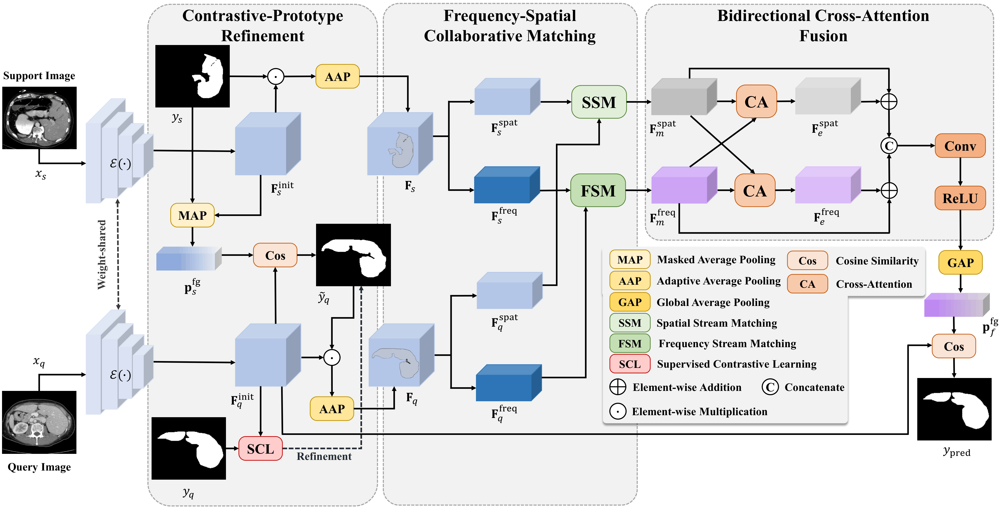

# FSCM-Net
The official pytorch implementation about ''Frequency-Spatial Collaborative Matching for Cross-Domain One-Shot Medical Image Segmentation''

## 💡 Overview of FSCM-Net 


## 📋 Abstract
Recent efforts have adapted cross-domain few-shot segmentation (CD-FSS) techniques to medical imaging, demonstrating initial success in bridging modality or institutional gaps. However, these approaches remain limited by two critical issues. First, they rely on unrefined prototype-based coarse predictions, which become highly unreliable under domain shift and propagate errors into matching stages. Second, these approaches suffer from unimodal reliance. Spatial-only methods are highly sensitive to domain-specific appearance variations, whereas frequency-only methods often compromise fine-grained geometric fidelity due to spectral abstraction. To overcome these issues, we propose the Frequency-Spatial Collaborative Matching Network (FSCMNet). Specifically, FSCMNet refines the coarse query mask via pixel-level supervised contrastive learning to improve feature discriminability. It further performs collaborative matching by jointly aligning support-query features in both the mid-frequency domain and the spatial domain. Finally, a bidirectional cross-attention fusion module enables mutual enhancement between the two streams. Experiments on three cross-domain benchmarks show FSCMNet achieves state-of-the-art performance, significantly outperforming existing methods.

## ⏳ Quick start

### 🛠 Dependencies
Please install the following essential dependencies:
```
dcm2niix
json5==0.8.5
jupyter==1.0.0
nibabel==2.5.1
numpy==1.22.0
opencv-python==4.5.5.62
Pillow>=8.1.1
sacred==0.8.2
scikit-image==0.18.3
SimpleITK==1.2.3
torch==1.10.2
torchvision=0.11.2
tqdm==4.62.3
```

### 📚 Datasets and Preprocessing
Please download:
1) **Abdominal MRI**: [Combined Healthy Abdominal Organ Segmentation dataset](https://chaos.grand-challenge.org/)
2) **Abdominal CT**: [Multi-Atlas Abdomen Labeling Challenge](https://www.synapse.org/#!Synapse:syn3193805/wiki/218292)
3) **Cardiac LGE and b-SSFP**: [Comprehensive Analysis & computing of REal-world medical images](https://zmic.org.cn/care_2025/)
4) **Prostate UCLH and NCI**: [Cross-institution Male Pelvic Structures](https://zenodo.org/records/7013610)

Pre-processing is performed according to [Ouyang et al.](https://github.com/cheng-01037/Self-supervised-Fewshot-Medical-Image-Segmentation/tree/2f2a22b74890cb9ad5e56ac234ea02b9f1c7a535) and we follow the procedure on their GitHub repository.

### 🔥 Training
1. Compile `./data/supervoxels/felzenszwalb_3d_cy.pyx` with cython (`python ./data/supervoxels/setup.py build_ext --inplace`) and run `./data/supervoxels/generate_supervoxels.py`
2. Download the pre-trained [ResNet-50 weights](https://download.pytorch.org/models/deeplabv3_resnet50_coco-cd0a2569.pth) and put in your checkpoints folder, then replace the absolute path in the code `./models/encoder.py`.  
3. Run `./script/train_<direction>.sh`, for example: `./scripts/train_AbdCT.sh`


### 🔍  Inference
Run `./script/test_<direction>.sh` 

## 🥰 Acknowledgements
Our code is built upon the work of [FAMNet](https://github.com/primebo1/FAMNet), we appreciate the authors for their excellent contributions!

## 📝 Citation
If you use this code for your research or project, please consider citing our paper. Thanks!🥂:
```bibtex
@ARTICLE{,
  author={},
  journal={}, 
  title={}, 
  year={},
  volume={},
  number={},
  pages={},
  doi={}
}
```

